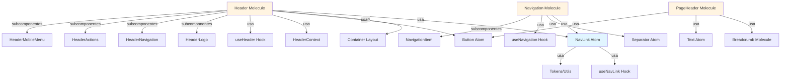

# Plano de Evolução do Design System - Componentes de Navegação e Layout

## Contexto e Análise

### Situação Atual

**App-Builder usa componentes customizados que deveriam estar no design system:**

- `NavLink` - Navegação com estados ativo/inativo (composição temporária com Text + Link)
- `Header/Navbar` horizontal - Para área deslogada e dashboard (HTML nativo)
- `MainNavigation` - Navegação horizontal com estados (usa composição temporária)
- `PageHeader` - Cabeçalho de página (usa Text, mas estrutura customizada)
- `AuthButtons` - Botões de autenticação (usa Button, mas wrapper customizado)

**Design System tem:**

- `SideNavbar` - Sidebar vertical complexa (não adequada para header horizontal)
- `DashboardLayout` - Template completo com sidebar (não adequado para header simples)
- `Breadcrumb` - Navegação hierárquica (já exportado)
- `Container`, `Stack` - Layouts básicos (existem mas subutilizados)

### Gaps Identificados

1. **NavLink (Atom)** - CRÍTICO

   - Necessário para navegação horizontal
   - Estados: ativo, inativo, desabilitado
   - Integração com Next.js Link
   - Acessibilidade (aria-current)

2. **Header/Navbar (Molecule)** - ALTO

   - Header horizontal para áreas deslogadas
   - Suporte a logo, navegação, ações (auth buttons)
   - Responsivo (mobile menu)
   - Variantes: default, elevated, bordered

3. **PageHeader (Molecule)** - MÉDIO

   - Melhorar estrutura existente
   - Adicionar variantes e slots
   - Breadcrumb integration

4. **Navigation (Molecule)** - MÉDIO

   - Componente de navegação horizontal
   - Usa NavLink internamente
   - Suporte a grupos e separadores

5. **Compatibilidade Header + SideNavbar** - CRÍTICO

   - Header deve funcionar standalone e com SideNavbar
   - Garantir que não quebra funcionalidade existente do SideNavbar
   - Layout coordenado quando ambos estão presentes
   - Mobile menus independentes e não conflitantes
   - Referência: DashboardLayout template e SideNavbar architecture

## Estrutura de Implementação

### Fase 1: NavLink (Atom) - PRIORIDADE CRÍTICA

**Localização**: `react-design-system/src/ui/atoms/NavLink/`

**Arquivos a criar:**

- `NavLink.tsx` - Componente principal
- `NavLink.test.tsx` - Testes unitários
- `NavLink.stories.tsx` - Storybook stories
- `index.ts` - Exports

**Props Interface:**

```typescript
interface NavLinkProps {
  href: string;
  children: React.ReactNode;
  active?: boolean; // Auto-detect se usar Next.js
  disabled?: boolean;
  variant?: 'default' | 'underline' | 'background';
  size?: 'sm' | 'md' | 'lg';
  as?: ElementType; // Para Next.js Link
  className?: string;
}
```

**Funcionalidades:**

- Estado ativo visual (underline, background, etc.)
- Integração com Next.js (usePathname hook)
- Acessibilidade (aria-current="page")
- Estados hover/focus
- Suporte a disabled
- Variantes de estilo

**Testes necessários:**

- Renderização básica
- Estado ativo
- Estado desabilitado
- Integração Next.js
- Acessibilidade (aria-current)
- Variantes visuais

**Stories necessárias:**

- Default
- Active state
- Disabled state
- Variants (underline, background)
- Sizes
- With Next.js Link
- Accessibility

### Fase 2: Header/Navbar (Molecule) - PRIORIDADE ALTA

**Localização**: `react-design-system/src/ui/molecules/Header/`

**Arquivos a criar:**

- `Header.tsx` - Componente principal
- `Header.test.tsx` - Testes
- `Header.stories.tsx` - Stories
- `index.ts` - Exports

**Props Interface:**

```typescript
interface HeaderProps {
  logo?: React.ReactNode;
  navigation?: React.ReactNode;
  actions?: React.ReactNode;
  variant?: 'default' | 'elevated' | 'bordered';
  sticky?: boolean;
  maxWidth?: 'sm' | 'md' | 'lg' | 'xl' | 'full';
  className?: string;
  children?: React.ReactNode;
}
```

**Estrutura:**

```
Header
├── Container (max-width)
│   ├── Logo (left)
│   ├── Navigation (center, optional)
│   └── Actions (right)
```

**Funcionalidades:**

- Layout responsivo (mobile menu)
- Sticky positioning
- Variantes visuais
- Slots para logo, navegação, ações
- Integração com Container do design system

**Testes necessários:**

- Renderização básica
- Layout responsivo
- Sticky positioning
- Variantes
- Slots (logo, navigation, actions)

**Stories necessárias:**

- Default
- With logo and navigation
- With actions
- Sticky
- Variants
- Responsive (mobile menu)
- Full example (app-builder use case)

### Fase 3: Navigation (Molecule) - PRIORIDADE MÉDIA

**Localização**: `react-design-system/src/ui/molecules/Navigation/`

**Arquivos a criar:**

- `Navigation.tsx` - Componente principal
- `Navigation.test.tsx` - Testes
- `Navigation.stories.tsx` - Stories
- `index.ts` - Exports

**Props Interface:**

```typescript
interface NavigationProps {
  items: NavItem[];
  orientation?: 'horizontal' | 'vertical';
  variant?: 'default' | 'pills' | 'tabs';
  className?: string;
}

interface NavItem {
  href: string;
  label: string;
  icon?: React.ReactNode;
  disabled?: boolean;
}
```

**Funcionalidades:**

- Usa NavLink internamente
- Orientação horizontal/vertical
- Variantes (default, pills, tabs)
- Suporte a ícones
- Grupos e separadores (futuro)

**Testes necessários:**

- Renderização de items
- Orientação
- Variantes
- Estados ativos
- Ícones

**Stories necessárias:**

- Horizontal navigation
- Vertical navigation
- With icons
- Variants
- Active states

### Fase 4: PageHeader (Molecule) - PRIORIDADE MÉDIA

**Localização**: `react-design-system/src/ui/molecules/PageHeader/`

**Melhorias no conceito existente:**

- Adicionar ao design system (atualmente só no app-builder)
- Variantes e slots
- Integração com Breadcrumb

**Props Interface:**

```typescript
interface PageHeaderProps {
  title: string;
  description?: string;
  breadcrumb?: BreadcrumbItem[];
  actions?: React.ReactNode;
  variant?: 'default' | 'compact';
  className?: string;
}
```

## Ordem de Implementação

### Sprint 1: NavLink (Atom)

1. Criar estrutura de diretórios
2. Implementar NavLink.tsx
3. Adicionar testes unitários
4. Criar stories no Storybook
5. Documentar no Storybook
6. Exportar em atoms/index.ts
7. Validar no app-builder

**Critérios de Sucesso:**

- NavLink funciona com Next.js Link
- Estados ativo/inativo funcionam corretamente
- Acessibilidade (aria-current) implementada
- Testes com cobertura >80%
- Stories completas no Storybook
- Integração no app-builder sem breaking changes

### Sprint 2: Header/Navbar (Molecule)

1. Criar estrutura de diretórios
2. Implementar Header.tsx
3. Adicionar testes
4. Criar stories
5. Documentar
6. Exportar em molecules/index.ts
7. Validar no app-builder

**Critérios de Sucesso:**

- Header funciona em desktop e mobile
- Sticky positioning funciona
- Variantes visuais implementadas
- **Compatibilidade com SideNavbar validada** (crítico)
- Header funciona standalone e com SideNavbar
- Mobile menus não conflitam
- Layout não quebra em nenhum cenário
- Testes com cobertura >80% (incluindo testes de compatibilidade)
- Stories completas (incluindo stories com SideNavbar)
- Substitui header customizado no app-builder

### Sprint 3: Navigation (Molecule)

1. Criar estrutura
2. Implementar Navigation.tsx (usa NavLink)
3. Adicionar testes
4. Criar stories
5. Documentar
6. Exportar
7. Validar no app-builder

**Critérios de Sucesso:**

- Navigation usa NavLink internamente
- Orientação horizontal/vertical funciona
- Variantes implementadas
- Testes completos
- Substitui MainNavigation no app-builder

### Sprint 4: PageHeader (Molecule)

1. Mover de app-builder para design system
2. Melhorar props e variantes
3. Adicionar testes
4. Criar stories
5. Documentar
6. Exportar
7. Atualizar app-builder para usar do design system

## Arquivos a Modificar

### Design System

**Novos arquivos:**

- `react-design-system/src/ui/atoms/NavLink/` (4 arquivos)
- `react-design-system/src/ui/molecules/Header/` (4 arquivos)
- `react-design-system/src/ui/molecules/Navigation/` (4 arquivos)
- `react-design-system/src/ui/molecules/PageHeader/` (4 arquivos)

**Arquivos a modificar:**

- `react-design-system/src/ui/atoms/index.ts` - Adicionar NavLink
- `react-design-system/src/ui/molecules/index.ts` - Adicionar Header, Navigation, PageHeader
- `react-design-system/src/ui/index.ts` - Re-exportar novos componentes

### App-Builder

**Arquivos a modificar:**

- `admin/app-builder/src/shared/components/navigation/MainNavigation.tsx` - Usar Navigation do design system
- `admin/app-builder/app/(dashboard)/layout.tsx` - Usar Header do design system
- `admin/app-builder/app/page.tsx` - Usar Header do design system
- `admin/app-builder/src/shared/components/layout/PageHeader.tsx` - Remover, usar do design system
- `admin/app-builder/src/shared/components/design-system/index.ts` - Adicionar exports

## Considerações Técnicas

### Dependências e Hierarquia

**NavLink (Atom):**

- ✅ Sem dependências de componentes do design system
- ✅ Pode usar tokens, utils, hooks
- ✅ Next.js (opcional, via `as` prop)
- ✅ usePathname hook (se Next.js disponível, via useNavLink)

**Header (Molecule):**

- ✅ Depende de: Container (layout), NavLink (atom), Button (atom), Text (atom)
- ✅ Pode usar: Drawer ou Modal para mobile menu (organisms)
- ✅ Context API para estado mobile menu

**Navigation (Molecule):**

- ✅ Depende de: NavLink (atom), Separator (atom), Text (atom)
- ✅ Sem Context (estado simples)

**PageHeader (Molecule):**

- ✅ Depende de: Breadcrumb (molecule), Text (atom), Button (atom)
- ✅ Sem Context (estado simples)

### Design Patterns por Componente

**NavLink:**

- Pattern: Componente simples com hook customizado
- Justificativa: Lógica de detecção de estado ativo é reutilizável, mas componente é simples

**Header:**

- Pattern: Compound Components + Context API + Slot Pattern
- Justificativa: Múltiplos subcomponentes precisam compartilhar estado (mobile menu), slots flexíveis

**Navigation:**

- Pattern: Componente simples (props) + Compound Components opcional (futuro)
- Justificativa: Maioria dos casos é simples (lista de items), compound para casos complexos

**PageHeader:**

- Pattern: Slot Pattern + Compound Components opcional
- Justificativa: Slots bem definidos, compound para flexibilidade extrema

### Acessibilidade

Todos os componentes devem:

- Suportar navegação por teclado
- Ter ARIA labels apropriados
- Ser compatíveis com screen readers
- Seguir WCAG 2.1 AA

### Responsividade

- Header deve ter mobile menu (hamburger)
- Navigation deve ser responsiva
- Breakpoints do design system

### Testes

- Testes unitários (Jest + React Testing Library)
- Testes de acessibilidade
- Testes visuais (se aplicável)
- Cobertura mínima: 80%

### Storybook

- Stories para cada variante
- Stories interativas
- Documentação MDX
- Exemplos de uso real (app-builder)

## Validação e Critérios de Sucesso

### Validação Técnica

- [ ] Todos os componentes compilam sem erros
- [ ] Testes passam (cobertura >80%)
- [ ] TypeScript sem erros
- [ ] Storybook funciona corretamente
- [ ] Linter sem erros

### Validação Funcional

- [ ] NavLink funciona com Next.js
- [ ] Header funciona em desktop e mobile
- [ ] Navigation substitui MainNavigation
- [ ] PageHeader substitui componente customizado
- [ ] App-builder funciona sem breaking changes

### Validação de Design

- [ ] Componentes seguem design tokens
- [ ] Variantes visuais funcionam
- [ ] Responsividade funciona
- [ ] Acessibilidade validada

## Riscos e Mitigações

### Risco 1: Breaking Changes

**Mitigação**: Manter backward compatibility, usar versionamento semântico

### Risco 2: Dependência Next.js

**Mitigação**: NavLink deve funcionar sem Next.js (fallback para `<a>`)

### Risco 3: Complexidade do Header

**Mitigação**: Começar simples, evoluir gradualmente

### Risco 4: Integração com app-builder

**Mitigação**: Testar integração em cada fase, não fazer tudo de uma vez

## Próximos Passos Após Este Plano

1. Validar plano com equipe
2. Criar issues/tasks no sistema de gestão
3. Iniciar Sprint 1 (NavLink)
4. Revisar e ajustar após cada sprint
5. Documentar lições aprendidas

## Diagrama de Hierarquia e Dependências



## Compatibilidade Header + SideNavbar

### Casos de Uso

**Caso 1: Header Standalone**

```tsx
// Página pública ou simples, sem sidebar
<Header>
  <Header.Logo href="/">AppBuilder</Header.Logo>
  <Header.Navigation>
    <Navigation items={navItems} />
  </Header.Navigation>
  <Header.Actions>
    <AuthButtons />
  </Header.Actions>
</Header>
```

**Caso 2: Header + SideNavbar (DashboardLayout Pattern)**

```tsx
// Dashboard completo com sidebar + header
<DashboardLayout
  sidebar={
    <SideNavbar>
      <SideNavbar.Navbar>
        <SideNavbar.Navbar.Item icon={<Home />} label="Home" />
      </SideNavbar.Navbar>
      <SideNavbar.Sidebar>
        <SideNavbar.Sidebar.Content>Sidebar Content</SideNavbar.Sidebar.Content>
      </SideNavbar.Sidebar>
    </SideNavbar>
  }
  header={
    <Header>
      <Header.Logo href="/">AppBuilder</Header.Logo>
      <Header.Actions>
        <UserButton />
      </Header.Actions>
    </Header>
  }
>
  <MainContent />
</DashboardLayout>
```

**Caso 3: Layout Manual (Header + SideNavbar)**

```tsx
// Layout customizado sem DashboardLayout
<div className="flex h-screen">
  <SideNavbar>
    {/* SideNavbar content */}
  </SideNavbar>
  <div className="flex-1 flex flex-col">
    <Header>
      {/* Header content */}
    </Header>
    <main>
      {/* Main content */}
    </main>
  </div>
</div>
```

### Garantias de Compatibilidade

1. **Contexts Independentes**:

   - `HeaderContext` (mobile menu do Header)
   - `SideNavbarContexts` (Theme, Config, State do SideNavbar)
   - Contexts não devem interferir entre si

2. **Layout Coordenado**:

   - Header ocupa área principal (direita do SideNavbar)
   - SideNavbar ocupa área lateral (esquerda)
   - Layout flex: `SideNavbar (flex-shrink-0) + Content Area (flex-1)`
   - Content Area: `Header (top) + Main (flex-1)`

3. **Mobile Responsivo**:

   - SideNavbar tem seu próprio mobile menu (overlay/drawer)
   - Header tem seu próprio mobile menu (hamburger)
   - Ambos podem estar ativos simultaneamente (casos raros)
   - Z-index coordenado: SideNavbar backdrop < Header mobile menu

4. **Breakpoints Alinhados**:

   - Header e SideNavbar devem usar os mesmos breakpoints do design system
   - Coordenação de `mobileBreakpoint` quando ambos estão presentes

5. **Z-Index Hierarchy**:
   ```
   SideNavbar backdrop: z-40
   Header mobile menu: z-50
   SideNavbar mobile menu: z-40 (mesmo nível do backdrop)
   ```


### Referências do SideNavbar

**Padrões a Seguir:**

- **Context Architecture**: SideNavbar usa 3 camadas de context (Theme, Config, State) - Header deve ter arquitetura similar mas independente
- **Compound Components**: SideNavbar usa compound components extensivamente - Header deve seguir mesmo padrão
- **Responsive Pattern**: SideNavbar tem `responsive`, `mobileBreakpoint`, `mobileVariant` - Header deve ter props similares
- **State Management**: SideNavbar gerencia estado mobile via context - Header deve fazer o mesmo de forma independente

**DashboardLayout como Referência:**

- `DashboardLayout` já suporta `header` prop
- Estrutura: `SideNavbar (left) + Content Area (right)`
- Content Area: `Header (top) + Main (bottom)`
- Header deve funcionar perfeitamente neste padrão

## Padrões de Uso Recomendados

### NavLink - Uso Simples

```tsx
// Caso básico
<NavLink href="/apps">Apps</NavLink>

// Com Next.js (auto-detect)
<NavLink href="/apps" as={Link}>Apps</NavLink>

// Com variante
<NavLink href="/apps" variant="underline">Apps</NavLink>
```

### Header - Compound Components

```tsx
// Uso completo
<Header variant="elevated" sticky>
  <Header.Logo href="/">AppBuilder</Header.Logo>
  <Header.Navigation>
    <Navigation items={navItems} />
  </Header.Navigation>
  <Header.Actions>
    <UserButton />
  </Header.Actions>
</Header>
```

### Navigation - Props Simples

```tsx
// Uso básico
<Navigation 
  items={[
    { href: '/apps', label: 'Apps' },
    { href: '/templates', label: 'Templates' }
  ]}
  orientation="horizontal"
  variant="default"
/>
```

### PageHeader - Props Simples

```tsx
// Uso básico
<PageHeader
  title="My Apps"
  description="Manage your applications"
  breadcrumb={breadcrumbItems}
  actions={<Button>Create</Button>}
/>
```

---

## Backlog Estruturado - Épicos, Stories e Tasks

> **Nota**: Esta seção contém o backlog completo estruturado em hierarquia de Épicos → User Stories → Tasks, seguindo o formato padrão do projeto (as/iWant/soThat) e com estimativas detalhadas.

A seção completa do backlog foi adicionada acima. Consulte as seções anteriores para:

- **ÉPICO 1**: NavLink Component (2 stories, 7 story points)
- **ÉPICO 2**: Header/Navbar Component (6 stories, 20 story points) - **inclui Story 2.4 crítica de compatibilidade SideNavbar**
- **ÉPICO 3**: Navigation Component (2 stories, 8 story points)
- **ÉPICO 4**: PageHeader Component (2 stories, 5 story points)

**Resumo**: 4 Épicos, 10 Stories, 31 Story Points totais.

---

## Referências

- [Guidelines de Evolução](admin/app-builder/docs/design-system-evolution/guidelines.md)
- [Question Checklist](admin/app-builder/docs/design-system-evolution/question-checklist.md)
- [Improvements Log](admin/app-builder/docs/design-system-evolution/improvements.md)
- [Advanced Composition Guide](react-design-system/docs/ADVANCED_COMPOSITION.md)
- [Categorization Guide](react-design-system/docs/CATEGORIZATION_GUIDE.md)
- [Architecture Guide](react-design-system/docs/ARCHITECTURE.md)
- Storybook: http://localhost:6006