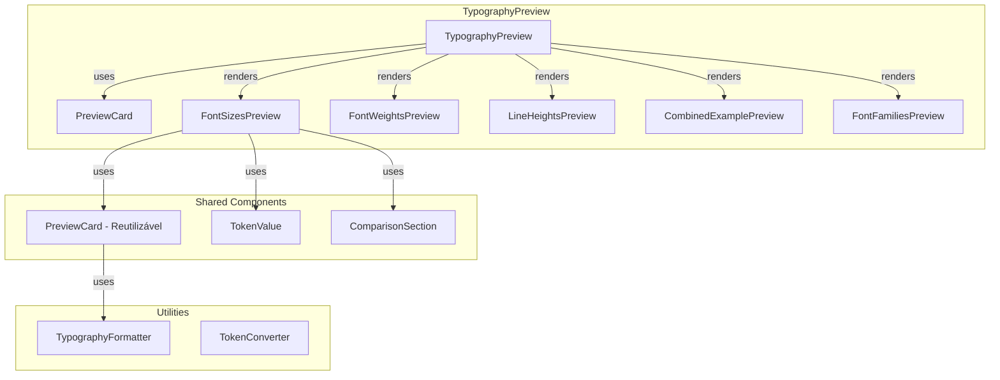

# Melhoria do TypographyPreview Baseado em TypographyPlayground

## Análise Comparativa

### TypographyPlayground (Referência)

**Estrutura de Preview:**

- Card com header consistente (`p-4 border-b`, título `font-semibold` fontSize 18px)
- Preview principal com texto customizável
- Card "All Font Sizes" com layout `flex items-baseline gap-4`
- Cada item mostra: label (w-16), texto com fontSize, valor (ml-auto)
- Usa `TypographyTokenFactory` para criar tokens
- CodeDisplay para código gerado

**Características:**

- Visualizações comparativas lado a lado
- Informações técnicas (px, rem, tailwind)
- Layout limpo e organizado
- Suporte a tema (dark/light)

### TypographyPreview Atual (AppBuilder)

**Estrutura Atual:**

- Cards simples com espaçamento vertical
- Preview básico de cada categoria (fontSizes, fontWeights, lineHeights)
- Combined Example com headings
- Sem informações técnicas detalhadas
- Sem visualização comparativa

**Limitações:**

- Não mostra todos os font sizes de forma comparativa
- Falta informações técnicas (rem, tailwind classes)
- Layout menos rico que TypographyPlayground
- Não usa padrões estabelecidos dos playgrounds

## Arquitetura Proposta

### Diagrama de Componentes



### Design Patterns a Implementar

1. **Component Composition Pattern**: Componentes menores e reutilizáveis
2. **Presentation/Container Pattern**: Separar lógica de apresentação
3. **Factory Pattern**: Para criar visualizações baseadas em focus
4. **Strategy Pattern**: Diferentes estratégias de visualização

## Implementação

### 1. Criar PreviewCard Component Reutilizável

**Arquivo:** `react-design-system/src/ui/tools/AppBuilder/components/GlobalConfig/previews/shared/PreviewCard.tsx`

**Responsabilidades:**

- Wrapper consistente para seções de preview
- Header padronizado (seguindo padrão dos playgrounds)
- Suporte a tema dark/light
- Padding e espaçamento consistentes

**Interface:**

```typescript
export interface PreviewCardProps {
  title: string;
  description?: string;
  children: React.ReactNode;
  className?: string;
}

export function PreviewCard({ title, description, children, className }: PreviewCardProps) {
  return (
    <Card>
      <div className="p-4 border-b border-gray-700">
        <h3 className="m-0 font-semibold text-gray-100" style={{ fontSize: '18px' }}>
          {title}
        </h3>
        {description && (
          <p className="text-xs text-gray-400 mt-1">{description}</p>
        )}
      </div>
      <div className="p-6">
        {children}
      </div>
    </Card>
  );
}
```

### 2. Criar TokenValue Component

**Arquivo:** `react-design-system/src/ui/tools/AppBuilder/components/GlobalConfig/previews/shared/TokenValue.tsx`

**Responsabilidades:**

- Exibir valores de tokens de forma consistente
- Mostrar px, rem, e tailwind class quando disponível
- Formatação padronizada

**Interface:**

```typescript
export interface TokenValueProps {
  label: string;
  value: string | number;
  unit?: 'px' | 'rem' | 'value';
  tailwind?: string;
  className?: string;
}

export function TokenValue({ label, value, unit, tailwind, className }: TokenValueProps) {
  return (
    <div className={cn('text-xs text-gray-400', className)}>
      <span className="font-medium">{label}:</span>{' '}
      <span>{value}{unit && ` ${unit}`}</span>
      {tailwind && <span className="ml-2 text-gray-500">({tailwind})</span>}
    </div>
  );
}
```

### 3. Refatorar FontSizesPreview

**Arquivo:** `react-design-system/src/ui/tools/AppBuilder/components/GlobalConfig/previews/sections/FontSizesPreview.tsx`

**Melhorias baseadas em TypographyPlayground:**

1. **Layout Comparativo:**

   - Usar `flex items-baseline gap-4` como no TypographyPlayground
   - Mostrar label (w-16), texto com fontSize, valor (ml-auto)

2. **Informações Técnicas:**

   - Mostrar px e rem
   - Incluir tailwind class se disponível
   - Formatação consistente

3. **Estrutura:**
```typescript
<PreviewCard title="All Font Sizes" description="Compare all available font sizes">
  <div className="flex flex-col gap-4">
    {Object.entries(typography.fontSizes).map(([key, size]) => (
      <div key={key} className="flex items-baseline gap-4">
        <div className="w-16 text-xs text-gray-400">{key}</div>
        <div
          style={{ fontSize: size.px }}
          className="text-gray-100 flex-1"
        >
          The quick brown fox jumps over the lazy dog
        </div>
        <div className="ml-auto text-xs text-gray-400">
          {size.px} / {size.rem}
        </div>
      </div>
    ))}
  </div>
</PreviewCard>
```


### 4. Refatorar FontWeightsPreview

**Arquivo:** `react-design-system/src/ui/tools/AppBuilder/components/GlobalConfig/previews/sections/FontWeightsPreview.tsx`

**Melhorias:**

- Layout comparativo similar
- Mostrar valor numérico e descrição
- Preview visual claro

### 5. Refatorar LineHeightsPreview

**Arquivo:** `react-design-system/src/ui/tools/AppBuilder/components/GlobalConfig/previews/sections/LineHeightsPreview.tsx`

**Melhorias:**

- Texto de exemplo mais longo (como no TypographyPlayground)
- Visualização clara do espaçamento entre linhas
- Informações técnicas (valor numérico)

### 6. Melhorar CombinedExamplePreview

**Arquivo:** `react-design-system/src/ui/tools/AppBuilder/components/GlobalConfig/previews/sections/CombinedExamplePreview.tsx`

**Melhorias:**

- Usar PreviewCard
- Adicionar mais exemplos (parágrafos, listas, etc.)
- Mostrar informações técnicas de cada heading
- Layout mais rico

### 7. Adicionar FontFamiliesPreview

**Arquivo:** `react-design-system/src/ui/tools/AppBuilder/components/GlobalConfig/previews/sections/FontFamiliesPreview.tsx`

**Novo componente:**

- Preview de font families
- Mostrar stack de fontes
- Exemplo visual de cada família

### 8. Refatorar TypographyPreview Principal

**Arquivo:** `react-design-system/src/ui/tools/AppBuilder/components/GlobalConfig/previews/TypographyPreview.tsx`

**Mudanças:**

- Usar componentes de seção refatorados
- Adicionar Preview Principal (como no TypographyPlayground)
- Organizar seções de forma mais clara
- Seguir padrão de espaçamento dos playgrounds

**Estrutura:**

```typescript
<div className="space-y-6 p-4">
  {/* Preview Principal - mostra configuração atual */}
  <PreviewCard title="Preview" description="Current typography configuration">
    <div style={{ fontSize, lineHeight, fontWeight, fontFamily }}>
      {sampleText}
    </div>
  </PreviewCard>

  {/* Seções baseadas em focus */}
  {focus === 'fontSizes' || !focus ? <FontSizesPreview /> : null}
  {focus === 'fontWeights' || !focus ? <FontWeightsPreview /> : null}
  {focus === 'lineHeights' || !focus ? <LineHeightsPreview /> : null}
  {focus === 'fontFamilies' || !focus ? <FontFamiliesPreview /> : null}
  
  {/* Combined Example - sempre mostrar quando não há focus */}
  {!focus && <CombinedExamplePreview />}
</div>
```

### 9. Criar Utilities para Formatação

**Arquivo:** `react-design-system/src/ui/tools/AppBuilder/components/GlobalConfig/previews/utils/typographyFormatter.ts`

**Funções:**

- `formatFontSize(size)`: Formata fontSize para exibição
- `formatLineHeight(height)`: Formata lineHeight
- `formatFontWeight(weight)`: Formata fontWeight
- `getTailwindClass(token, type)`: Obtém classe tailwind se disponível

### 10. Adicionar Suporte a Texto Customizável (Opcional)

**Melhoria Futura:**

- Permitir editar texto de exemplo
- Salvar preferência do usuário
- Usar texto padrão se não customizado

## Estrutura de Arquivos Proposta

```
previews/
├── TypographyPreview.tsx (refatorado)
├── shared/
│   ├── PreviewCard.tsx (novo)
│   ├── TokenValue.tsx (novo)
│   └── index.ts
├── sections/
│   ├── FontSizesPreview.tsx (novo, extraído)
│   ├── FontWeightsPreview.tsx (novo, extraído)
│   ├── LineHeightsPreview.tsx (novo, extraído)
│   ├── FontFamiliesPreview.tsx (novo)
│   ├── CombinedExamplePreview.tsx (novo, extraído)
│   └── index.ts
└── utils/
    ├── typographyFormatter.ts (novo)
    └── index.ts
```

## Padrões de Visualização

### 1. Preview Principal

- Card com título "Preview"
- Mostra configuração atual aplicada
- Texto de exemplo customizável (futuro)

### 2. All Font Sizes

- Layout: `flex items-baseline gap-4`
- Estrutura: Label | Texto | Valor
- Informações: px / rem

### 3. Font Weights

- Layout similar ao Font Sizes
- Mostrar valor numérico (300, 400, 500, etc.)
- Preview visual claro

### 4. Line Heights

- Texto de exemplo mais longo
- Visualização clara do espaçamento
- Valor numérico ou ratio

### 5. Font Families

- Mostrar stack completo
- Preview de cada família
- Informações técnicas

### 6. Combined Example

- Headings (h1-h4)
- Parágrafos
- Listas
- Outros elementos tipográficos

## Compatibilidade e Migração

### Backward Compatibility

- Manter interface `TypographyPreviewProps` existente
- Manter prop `focus` funcionando
- Não quebrar código existente

### Migração Gradual

1. Criar componentes novos em `sections/`
2. Refatorar TypographyPreview para usar novos componentes
3. Manter comportamento existente
4. Adicionar melhorias progressivamente

## Validação

1. Preview segue padrões do TypographyPlayground
2. Cards têm headers consistentes
3. Layout comparativo funciona corretamente
4. Informações técnicas são exibidas
5. Suporte a tema dark/light
6. Componentes são reutilizáveis
7. Código mais limpo e manutenível
8. Performance mantida ou melhorada