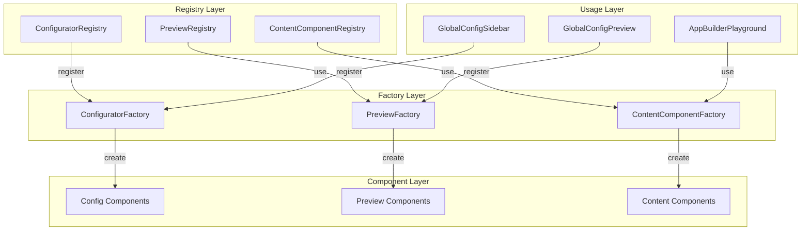

# Sistema de Registry/Factory para Configurators e Previews

## Objetivo

Implementar padrão **Registry/Factory** para gerenciar configurators, previews e content components de forma extensível, removendo acoplamento hardcoded (switch/case, imports diretos) e permitindo registro dinâmico e customização de componentes.

## Análise da Estrutura Atual

### Problemas Identificados

1. **Acoplamento Hardcoded**: `GlobalConfigPreview` usa switch/case para decidir qual preview mostrar
2. **Imports Diretos**: Configs (TypographyConfig, ColorsConfig) importam configurators diretamente
3. **Duplicação**: Lógica de mapeamento repetida em vários lugares
4. **Falta de Extensibilidade**: Difícil adicionar novos tipos de config sem modificar múltiplos arquivos
5. **Sem Customização**: Não há forma de customizar ou substituir componentes em runtime

### Estrutura Atual

```
GlobalConfig/
├── configurators/        # FontSizeConfigurator, FontWeightConfigurator, etc.
├── previews/             # TypographyPreview, ColorsPreview, etc.
├── content/              # TypographyContent, ColorsContent, etc.
├── TypographyConfig.tsx  # Usa imports diretos de configurators
├── ColorsConfig.tsx      # Usa imports diretos
├── GlobalConfigPreview.tsx # Usa switch/case para mapear previews
└── GlobalConfigSidebar.tsx # Usa imports diretos de configs
```

## Arquitetura Proposta com Registry/Factory

### Diagrama de Arquitetura



### Estrutura de Arquivos Proposta

```
GlobalConfig/
├── registry/
│   ├── ConfiguratorRegistry.ts        # Registry para configurators
│   ├── PreviewRegistry.ts             # Registry para previews
│   ├── ContentComponentRegistry.ts     # Registry para content components
│   ├── types.ts                       # Types compartilhados
│   └── index.ts                       # Exports centralizados
├── factory/
│   ├── ConfiguratorFactory.ts         # Factory para criar configurators
│   ├── PreviewFactory.ts              # Factory para criar previews
│   ├── ContentComponentFactory.ts     # Factory para criar content components
│   └── index.ts
├── configurators/                     # Mantém estrutura atual
├── previews/                          # Mantém estrutura atual
├── content/                           # Mantém estrutura atual
└── ... (outros arquivos)
```

## Implementação

### 1. Criar Types Base para Registry

**Arquivo:** `react-design-system/src/ui/tools/AppBuilder/components/GlobalConfig/registry/types.ts`

**Conteúdo:**

```typescript
import type { ComponentType, ReactNode } from 'react';
import type { GlobalTokensConfig } from '../../../types';

// Base interface para todos os registros
export interface RegistryEntry<T = any> {
  id: string;
  category: string;
  component: ComponentType<T>;
  metadata?: {
    label?: string;
    description?: string;
    icon?: ReactNode;
    order?: number;
  };
}

// Configurator Entry
export interface ConfiguratorEntry extends RegistryEntry<ConfiguratorProps> {
  category: string; // 'typography', 'colors', etc.
  subcategory: string; // 'fontSizes', 'fontWeights', etc.
}

export interface ConfiguratorProps {
  className?: string;
}

// Preview Entry
export interface PreviewEntry extends RegistryEntry<PreviewProps> {
  category: string;
  subcategory?: string; // Opcional para previews focados
}

export interface PreviewProps {
  config: GlobalTokensConfig;
  focus?: string;
}

// Content Component Entry
export interface ContentComponentEntry extends RegistryEntry<ContentComponentProps> {
  category: string;
}

export interface ContentComponentProps {
  config: GlobalTokensConfig | null;
}

// Registry Interface
export interface IRegistry<T extends RegistryEntry> {
  register(entry: T): void;
  unregister(id: string): void;
  get(id: string): T | undefined;
  getByCategory(category: string): T[];
  getAll(): T[];
  has(id: string): boolean;
  clear(): void;
}
```

### 2. Implementar ConfiguratorRegistry

**Arquivo:** `react-design-system/src/ui/tools/AppBuilder/components/GlobalConfig/registry/ConfiguratorRegistry.ts`

**Conteúdo:**

```typescript
import type { ConfiguratorEntry, IRegistry } from './types';

class ConfiguratorRegistry implements IRegistry<ConfiguratorEntry> {
  private entries: Map<string, ConfiguratorEntry> = new Map();

  register(entry: ConfiguratorEntry): void {
    const id = this.generateId(entry.category, entry.subcategory);
    if (this.entries.has(id)) {
      console.warn(`Configurator with id "${id}" already exists. Overwriting.`);
    }
    this.entries.set(id, { ...entry, id });
  }

  unregister(id: string): void {
    this.entries.delete(id);
  }

  get(id: string): ConfiguratorEntry | undefined {
    return this.entries.get(id);
  }

  getByCategory(category: string): ConfiguratorEntry[] {
    return Array.from(this.entries.values())
      .filter(entry => entry.category === category)
      .sort((a, b) => (a.metadata?.order || 0) - (b.metadata?.order || 0));
  }

  getByCategoryAndSubcategory(category: string, subcategory: string): ConfiguratorEntry | undefined {
    const id = this.generateId(category, subcategory);
    return this.entries.get(id);
  }

  getAll(): ConfiguratorEntry[] {
    return Array.from(this.entries.values());
  }

  has(id: string): boolean {
    return this.entries.has(id);
  }

  clear(): void {
    this.entries.clear();
  }

  private generateId(category: string, subcategory: string): string {
    return `${category}-${subcategory}`;
  }
}

// Singleton instance
export const configuratorRegistry = new ConfiguratorRegistry();
```

### 3. Implementar PreviewRegistry

**Arquivo:** `react-design-system/src/ui/tools/AppBuilder/components/GlobalConfig/registry/PreviewRegistry.ts`

**Conteúdo:**

```typescript
import type { PreviewEntry, IRegistry } from './types';

class PreviewRegistry implements IRegistry<PreviewEntry> {
  private entries: Map<string, PreviewEntry> = new Map();

  register(entry: PreviewEntry): void {
    const id = entry.subcategory 
      ? `${entry.category}-${entry.subcategory}`
      : entry.category;
    
    if (this.entries.has(id)) {
      console.warn(`Preview with id "${id}" already exists. Overwriting.`);
    }
    this.entries.set(id, { ...entry, id });
  }

  unregister(id: string): void {
    this.entries.delete(id);
  }

  get(id: string): PreviewEntry | undefined {
    return this.entries.get(id);
  }

  getByCategory(category: string): PreviewEntry[] {
    return Array.from(this.entries.values())
      .filter(entry => entry.category === category);
  }

  getAll(): PreviewEntry[] {
    return Array.from(this.entries.values());
  }

  has(id: string): boolean {
    return this.entries.has(id);
  }

  clear(): void {
    this.entries.clear();
  }

  // Helper para obter preview baseado em activeAccordionId
  getByAccordionId(accordionId: string): PreviewEntry | undefined {
    const [category, subcategory] = accordionId.split('-');
    const id = subcategory ? `${category}-${subcategory}` : category;
    return this.entries.get(id) || this.entries.get(category);
  }
}

export const previewRegistry = new PreviewRegistry();
```

### 4. Implementar ContentComponentRegistry

**Arquivo:** `react-design-system/src/ui/tools/AppBuilder/components/GlobalConfig/registry/ContentComponentRegistry.ts`

**Conteúdo:**

```typescript
import type { ContentComponentEntry, IRegistry } from './types';

class ContentComponentRegistry implements IRegistry<ContentComponentEntry> {
  private entries: Map<string, ContentComponentEntry> = new Map();

  register(entry: ContentComponentEntry): void {
    if (this.entries.has(entry.id)) {
      console.warn(`Content component with id "${entry.id}" already exists. Overwriting.`);
    }
    this.entries.set(entry.id, entry);
  }

  unregister(id: string): void {
    this.entries.delete(id);
  }

  get(id: string): ContentComponentEntry | undefined {
    return this.entries.get(id);
  }

  getByCategory(category: string): ContentComponentEntry | undefined {
    return Array.from(this.entries.values())
      .find(entry => entry.category === category);
  }

  getAll(): ContentComponentEntry[] {
    return Array.from(this.entries.values());
  }

  has(id: string): boolean {
    return this.entries.has(id);
  }

  clear(): void {
    this.entries.clear();
  }
}

export const contentComponentRegistry = new ContentComponentRegistry();
```

### 5. Implementar Factories

**Arquivo:** `react-design-system/src/ui/tools/AppBuilder/components/GlobalConfig/factory/ConfiguratorFactory.ts`

**Conteúdo:**

```typescript
import { configuratorRegistry } from '../registry/ConfiguratorRegistry';
import type { ConfiguratorEntry, ConfiguratorProps } from '../registry/types';

export class ConfiguratorFactory {
  static create(category: string, subcategory: string, props?: ConfiguratorProps) {
    const entry = configuratorRegistry.getByCategoryAndSubcategory(category, subcategory);
    if (!entry) {
      console.warn(`Configurator not found: ${category}-${subcategory}`);
      return null;
    }
    const Component = entry.component;
    return <Component {...(props || {})} />;
  }

  static getAllByCategory(category: string) {
    return configuratorRegistry.getByCategory(category);
  }

  static has(category: string, subcategory: string): boolean {
    return configuratorRegistry.has(`${category}-${subcategory}`);
  }
}
```

**Arquivo:** `react-design-system/src/ui/tools/AppBuilder/components/GlobalConfig/factory/PreviewFactory.ts`

**Conteúdo:**

```typescript
import { previewRegistry } from '../registry/PreviewRegistry';
import type { PreviewEntry, PreviewProps } from '../registry/types';

export class PreviewFactory {
  static create(accordionId: string | null, props: PreviewProps) {
    if (!accordionId) {
      return null;
    }
    const entry = previewRegistry.getByAccordionId(accordionId);
    if (!entry) {
      console.warn(`Preview not found for: ${accordionId}`);
      return null;
    }
    const Component = entry.component;
    return <Component {...props} />;
  }

  static getByCategory(category: string) {
    return previewRegistry.getByCategory(category);
  }
}
```

**Arquivo:** `react-design-system/src/ui/tools/AppBuilder/components/GlobalConfig/factory/ContentComponentFactory.ts`

**Conteúdo:**

```typescript
import { contentComponentRegistry } from '../registry/ContentComponentRegistry';
import type { ContentComponentEntry, ContentComponentProps } from '../registry/types';

export class ContentComponentFactory {
  static create(category: string, props: ContentComponentProps) {
    const entry = contentComponentRegistry.getByCategory(category);
    if (!entry) {
      console.warn(`Content component not found: ${category}`);
      return null;
    }
    const Component = entry.component;
    return <Component {...props} />;
  }

  static has(category: string): boolean {
    return contentComponentRegistry.has(category);
  }
}
```

### 6. Criar Módulo de Registro Inicial

**Arquivo:** `react-design-system/src/ui/tools/AppBuilder/components/GlobalConfig/registry/registerDefaults.ts`

**Conteúdo:**

```typescript
import { configuratorRegistry } from './ConfiguratorRegistry';
import { previewRegistry } from './PreviewRegistry';
import { contentComponentRegistry } from './ContentComponentRegistry';

// Configurators
import { FontSizeConfigurator } from '../configurators/FontSizeConfigurator';
import { FontWeightConfigurator } from '../configurators/FontWeightConfigurator';
import { LineHeightConfigurator } from '../configurators/LineHeightConfigurator';

// Previews
import { TypographyPreview } from '../previews/TypographyPreview';
import { ColorsPreview } from '../previews/ColorsPreview';
import { SpacingPreview } from '../previews/SpacingPreview';
import { ShadowsPreview } from '../previews/ShadowsPreview';
import { RadiusPreview } from '../previews/RadiusPreview';

// Content Components
import { TypographyContent } from '../content/TypographyContent';
import { ColorsContent } from '../content/ColorsContent';
import { SpacingContent } from '../content/SpacingContent';

/**
 * Registra todos os componentes padrão no sistema de registry
 * Deve ser chamado uma vez na inicialização da aplicação
 */
export function registerDefaultComponents() {
  // Registrar Configurators
  configuratorRegistry.register({
    id: 'typography-fontSizes',
    category: 'typography',
    subcategory: 'fontSizes',
    component: FontSizeConfigurator,
    metadata: {
      label: 'Font Sizes',
      order: 1,
    },
  });

  configuratorRegistry.register({
    id: 'typography-fontWeights',
    category: 'typography',
    subcategory: 'fontWeights',
    component: FontWeightConfigurator,
    metadata: {
      label: 'Font Weights',
      order: 2,
    },
  });

  configuratorRegistry.register({
    id: 'typography-lineHeights',
    category: 'typography',
    subcategory: 'lineHeights',
    component: LineHeightConfigurator,
    metadata: {
      label: 'Line Heights',
      order: 3,
    },
  });

  // Registrar Previews
  previewRegistry.register({
    id: 'typography',
    category: 'typography',
    component: TypographyPreview,
  });

  previewRegistry.register({
    id: 'colors',
    category: 'colors',
    component: ColorsPreview,
  });

  previewRegistry.register({
    id: 'spacing',
    category: 'spacing',
    component: SpacingPreview,
  });

  previewRegistry.register({
    id: 'shadows',
    category: 'shadows',
    component: ShadowsPreview,
  });

  previewRegistry.register({
    id: 'radius',
    category: 'radius',
    component: RadiusPreview,
  });

  // Registrar Content Components
  contentComponentRegistry.register({
    id: 'typography',
    category: 'typography',
    component: TypographyContent,
  });

  contentComponentRegistry.register({
    id: 'colors',
    category: 'colors',
    component: ColorsContent,
  });

  contentComponentRegistry.register({
    id: 'spacing',
    category: 'spacing',
    component: SpacingContent,
  });
}
```

### 7. Refatorar GlobalConfigPreview para Usar Factory

**Arquivo:** `react-design-system/src/ui/tools/AppBuilder/components/GlobalConfig/GlobalConfigPreview.tsx`

**Mudanças:**

```typescript
import { PreviewFactory } from './factory/PreviewFactory';

export function GlobalConfigPreview({
  config,
  activeAccordionId,
}: GlobalConfigPreviewProps) {
  const preview = PreviewFactory.create(activeAccordionId, { config });

  if (!preview) {
    return (
      <div className="flex items-center justify-center h-full p-8">
        <div className="text-center">
          <p className="text-sm text-gray-400">
            {activeAccordionId 
              ? `Preview not available for: ${activeAccordionId}`
              : 'Select a configuration section to see preview'}
          </p>
        </div>
      </div>
    );
  }

  return preview;
}
```

### 8. Refatorar TypographyConfig para Usar Factory

**Arquivo:** `react-design-system/src/ui/tools/AppBuilder/components/GlobalConfig/TypographyConfig.tsx`

**Mudanças:**

```typescript
import { ConfiguratorFactory } from './factory/ConfiguratorFactory';

export function TypographyConfig({
  onAccordionChange,
  className = '',
}: TypographyConfigProps) {
  // ... código existente ...

  // Obter configurators do registry
  const configurators = ConfiguratorFactory.getAllByCategory('typography');

  const accordionItems = configurators.map((entry) => ({
    id: entry.subcategory,
    title: entry.metadata?.label || entry.subcategory,
    content: ConfiguratorFactory.create('typography', entry.subcategory),
    disabled: false,
  }));

  // Adicionar fontFamilies manualmente (ou criar configurator para isso)
  accordionItems.push({
    id: 'fontFamilies',
    title: 'Font Families',
    content: (/* ... código existente ... */),
    disabled: false,
  });

  return (
    <div className={className}>
      <Accordion
        type="single"
        items={accordionItems}
        defaultOpen={openItem}
        onValueChange={handleValueChange}
      />
    </div>
  );
}
```

### 9. Refatorar AppBuilderPlayground para Usar ContentComponentFactory

**Arquivo:** `react-design-system/src/ui/playgrounds/AppBuilderPlayground.tsx`

**Mudanças:**

```typescript
import { ContentComponentFactory } from '../tools/AppBuilder/components/GlobalConfig/factory/ContentComponentFactory';

// No renderContent:
const renderContent = useCallback(() => {
  if (!globalConfig) {
    return (/* ... */);
  }

  const content = ContentComponentFactory.create(activeContentId || '', { config: globalConfig });
  
  if (!content) {
    return (/* fallback */);
  }

  return content;
}, [activeContentId, globalConfig]);
```

### 10. Inicializar Registry na Aplicação

**Arquivo:** `react-design-system/src/ui/playgrounds/AppBuilderPlayground.tsx`

**Mudanças:**

```typescript
import { registerDefaultComponents } from '../tools/AppBuilder/components/GlobalConfig/registry/registerDefaults';
import { useEffect } from 'react';

export function AppBuilderPlayground() {
  // Registrar componentes padrão uma vez
  useEffect(() => {
    registerDefaultComponents();
  }, []);

  // ... resto do código ...
}
```

## Benefícios do Padrão Registry/Factory

1. **Extensibilidade**: Fácil adicionar novos configurators/previews sem modificar código existente
2. **Customização**: Permite substituir componentes em runtime
3. **Testabilidade**: Fácil mockar registries para testes
4. **Manutenibilidade**: Código mais limpo, sem switch/case ou imports hardcoded
5. **Type Safety**: TypeScript garante tipos corretos em todos os registros
6. **Lazy Loading**: Possibilidade de carregar componentes sob demanda

## Migração e Compatibilidade

- Manter componentes existentes funcionando
- Registrar componentes padrão na inicialização
- Permitir registro adicional de componentes customizados
- Backward compatible com código existente

## Arquivos a Criar/Modificar

### Novos Arquivos

1. `registry/types.ts` - Types compartilhados
2. `registry/ConfiguratorRegistry.ts` - Registry para configurators
3. `registry/PreviewRegistry.ts` - Registry para previews
4. `registry/ContentComponentRegistry.ts` - Registry para content components
5. `registry/registerDefaults.ts` - Registro de componentes padrão
6. `registry/index.ts` - Exports centralizados
7. `factory/ConfiguratorFactory.ts` - Factory para configurators
8. `factory/PreviewFactory.ts` - Factory para previews
9. `factory/ContentComponentFactory.ts` - Factory para content components
10. `factory/index.ts` - Exports centralizados

### Arquivos a Modificar

1. `GlobalConfigPreview.tsx` - Usar PreviewFactory
2. `TypographyConfig.tsx` - Usar ConfiguratorFactory
3. `ColorsConfig.tsx` - Usar ConfiguratorFactory (se aplicável)
4. `AppBuilderPlayground.tsx` - Usar ContentComponentFactory e inicializar registry
5. `configurators/*.tsx` - Remover previews (conforme plano anterior)
6. `content/TypographyContent.tsx` - Adicionar campos + preview (conforme plano anterior)

## Validação

1. Registry funciona corretamente para registrar/obter componentes
2. Factories criam componentes corretamente
3. Componentes padrão são registrados na inicialização
4. Sistema funciona sem acoplamento hardcoded
5. É possível adicionar novos componentes sem modificar código existente
6. Type safety mantido em todo o sistema