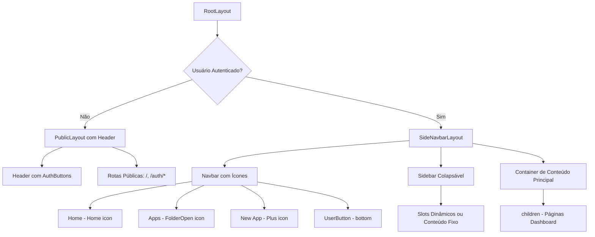

# Implementação SideNavbar Admin AppBuilder

## Contexto

Atualmente, o `admin/app-builder` usa um `Header` com `Navigation` tabs para todas as páginas do dashboard, independente do estado de autenticação. O objetivo é implementar uma `SideNavbar` colapsável (similar ao playground do AppBuilder) que será usada quando o usuário estiver logado, mantendo o `Header` apenas para usuários não autenticados.

**Referência**: `react-design-system/src/ui/playgrounds/AppBuilderPlayground.tsx`

## Resumo Executivo

### Mudanças Principais

1. **Estrutura de Rotas**

   - Criar grupo de rotas `(public)/` para páginas públicas (home, etc.)
   - Manter `(dashboard)/` para rotas privadas (requerem autenticação)
   - Manter `(auth)/` para rotas de autenticação

2. **Layouts**

   - **Público**: `PublicLayout` com Header simples e AuthButtons
   - **Privado**: `SideNavbarLayout` com SideNavbar colapsável

3. **Navegação na SideNavbar**

   - **Rotas**: Home (`/`), Apps (`/apps`)
   - **Ações rápidas**: New App (`/apps/new`)
   - **Ícones**: Lucide React (Home, FolderOpen, Plus)
   - **Avatar do Usuário**: Parte inferior da Navbar
     - Usar `useUser` do Clerk para obter dados (imageUrl, nome)
     - Usar componente `Avatar` do design system
     - Fallback para iniciais quando não houver imagem
     - Integrar com UserButton do Clerk para menu dropdown

4. **Responsividade**

   - **Mobile** (< 768px): Overlay com backdrop (semi-transparente)
   - **Desktop** (>= 768px): SideNavbar fixa à esquerda
   - Estado de colapso persistido em localStorage

## Arquitetura Proposta



## Estrutura de Arquivos

```
admin/app-builder/
├── app/
│   ├── (public)/                         # NOVO: Rotas públicas agrupadas
│   │   ├── layout.tsx                    # NOVO: Layout público com Header
│   │   ├── page.tsx                      # MOVER: Home page (pública)
│   │   └── ...
│   ├── (dashboard)/                      # Rotas privadas (requerem auth)
│   │   ├── layout.tsx                    # REFATORAR: Usar SideNavbar quando logado
│   │   ├── apps/
│   │   │   ├── page.tsx
│   │   │   ├── new/
│   │   │   └── [id]/
│   │   └── ...
│   ├── (auth)/                           # Rotas de autenticação (já existe)
│   │   └── ...
│   └── layout.tsx                        # Root layout (sem mudanças)
├── src/
│   └── shared/
│       └── components/
│           └── layout/
│               ├── DashboardLayout.tsx   # DEPRECATED (substituído)
│               ├── SideNavbarLayout.tsx   # NOVO: Layout com SideNavbar
│               └── PublicLayout.tsx       # NOVO: Layout com Header (não logado)
```

## Fase 1: SideNavbar Colapsável Básica

### Objetivo

Implementar a estrutura básica da SideNavbar colapsável sem customização, apenas posicionamento e funcionalidade de colapsar/expandir.

### Tarefas

1. **Criar `SideNavbarLayout.tsx`**

   - Localização: `src/shared/components/layout/SideNavbarLayout.tsx`
   - Usar `SideNavbar` do design system com configuração básica:
     ```tsx
     <SideNavbar
       mode="full"
       variant="elevated"
       width="320px"
       navigationWidth="56px"
       responsive
       mobileBreakpoint={768}
       mobileVariant="overlay"
       overlayBackdrop={true}
       defaultCollapsed={false}
       storageKey="app-builder-sidebar"
     >
       {/* Navbar e Sidebar básicos */}
     </SideNavbar>
     ```

   - Layout: `h-screen flex flex-col` para container raiz, `flex-1 flex overflow-hidden` para container principal
   - Container de conteúdo: `flex-1 overflow-auto` ao lado da SideNavbar
   - Mobile: Usar `mobileVariant="overlay"` e `overlayBackdrop={true}` para overlay com backdrop

2. **Criar `PublicLayout.tsx`**

   - Localização: `src/shared/components/layout/PublicLayout.tsx`
   - Manter estrutura atual do Header para usuários não autenticados
   - Extrair lógica do Header atual para reutilização
   - Incluir `ToastContainer` para feedback ao usuário

3. **Reorganizar Estrutura de Rotas**

   - Criar `app/(public)/` para rotas públicas (não requerem autenticação)
   - Mover `app/page.tsx` para `app/(public)/page.tsx` (home page pública)
   - Criar `app/(public)/layout.tsx` com `PublicLayout` (Header com AuthButtons)
   - Manter `app/(auth)/` para rotas de autenticação (já existe)
   - Refatorar `app/(dashboard)/layout.tsx` para usar `SideNavbarLayout` (sempre logado, protegido por middleware)
   - Remover lógica condicional de `(dashboard)/layout.tsx` (middleware já protege)
   - Atualizar `proxy.ts` (middleware) se necessário
     - Nota: Route groups `(public)` não aparecem na URL, então `/` continua sendo a rota pública
     - Verificar se middleware já permite `/` como rota pública (já está configurado)

4. **Refatorar `app/(dashboard)/layout.tsx`**

   - Remover `SignedIn`/`SignedOut` (middleware já protege)
   - Sempre renderizar `SideNavbarLayout` (usuário já está autenticado)
   - Manter `ToastContainer`

4. **Testes Básicos**

   - Verificar renderização condicional (logado vs não logado)
   - Verificar que SideNavbar colapsa/expande
   - Verificar responsividade básica

### Arquivos a Modificar/Criar

- `src/shared/components/layout/SideNavbarLayout.tsx` (NOVO)
- `src/shared/components/layout/PublicLayout.tsx` (NOVO)
- `app/(public)/layout.tsx` (NOVO)
- `app/(public)/page.tsx` (MOVER de `app/page.tsx`)
- `app/(dashboard)/layout.tsx` (REFATORAR)
- `proxy.ts` (ATUALIZAR: adicionar `(public)/*` às rotas públicas)

### Critérios de Sucesso Fase 1

- SideNavbar renderiza quando usuário está logado (em rotas do dashboard)
- SideNavbar colapsa/expande corretamente
- Header renderiza quando usuário não está logado (em rotas públicas)
- Rotas públicas agrupadas em `(public)/` funcionam corretamente
- Layout responsivo básico funciona
- Container de conteúdo principal está posicionado corretamente
- Middleware atualizado para permitir acesso a rotas públicas

---

## Fase 2: Posicionamento e Container de Conteúdo

### Objetivo

Garantir que a SideNavbar e o container de conteúdo principal estejam corretamente posicionados, com espaçamento adequado e scroll correto.

### Tarefas

1. **Ajustar Layout do Container Principal**

   - Container deve ocupar espaço restante após SideNavbar
   - Scroll deve funcionar apenas no container, não na página inteira
   - Altura: `h-screen` no container raiz, `flex-1` no container de conteúdo

2. **Configurar Sidebar Básica**

   - Sidebar deve ter Header básico (título)
   - Sidebar deve ter Content area (scrollável)
   - Por enquanto, conteúdo placeholder ou vazio

3. **Ajustar Responsividade**

   - Mobile (< 768px): SideNavbar usa overlay com backdrop (semi-transparente)
   - Backdrop fecha sidebar ao clicar (comportamento padrão do SideNavbar)
   - Desktop (>= 768px): SideNavbar fixa à esquerda, estado persistido em localStorage
   - Breakpoint: 768px (tablet)
   - Configurar `mobileVariant="overlay"` e `overlayBackdrop={true}` no SideNavbar

4. **Testes de Layout**

   - Verificar que conteúdo não fica escondido atrás da SideNavbar
   - Verificar scroll independente (sidebar vs conteúdo)
   - Verificar responsividade em diferentes tamanhos de tela

### Arquivos a Modificar

- `src/shared/components/layout/SideNavbarLayout.tsx` (AJUSTAR)

### Critérios de Sucesso Fase 2

- Container de conteúdo está corretamente posicionado
- Scroll funciona independentemente na sidebar e no conteúdo
- Layout responsivo funciona corretamente
- Mobile: Overlay com backdrop aparece corretamente (< 768px)
- Mobile: Backdrop fecha sidebar ao clicar
- Desktop: SideNavbar fixa à esquerda (>= 768px)
- Espaçamento e padding estão adequados

---

## Fase 3: Rotas e Botões com Ícones de Navegação

### Objetivo

Adicionar itens de navegação na Navbar com ícones, rotas e estados ativos, similar ao playground do AppBuilder.

### Tarefas

1. **Definir Estrutura de Navegação**

   - Rotas de navegação:
     - Home (`/`) - ícone: `Home` (Lucide React)
     - Apps (`/apps`) - ícone: `FolderOpen` (Lucide React)
   - Ações rápidas na Navbar:
     - New App (`/apps/new`) - ícone: `Plus` (Lucide React)
     - Separador antes das ações rápidas
   - Usar `usePathname` do Next.js para detectar rota ativa
   - Usar `useRouter` do Next.js para navegação
   - Avatar do usuário na parte inferior da Navbar (com UserButton integrado)

2. **Implementar Navbar Items**

   - Usar `SideNavbar.Navbar.Item` para cada rota
   - Configurar `active` baseado em `pathname`
   - Configurar `onClick` para navegação
   - Adicionar `labelMode="tooltip"` para mostrar labels em tooltip quando colapsado

3. **Adicionar Separadores**

   - Usar `SideNavbar.Navbar.Separator` para separar:
     - Navegação principal (Home, Apps)
     - Ações rápidas (New App)
     - UserButton (parte inferior)

4. **Implementar Avatar do Usuário**

   - **Decisão de Implementação**: 
     - **Opção A (Recomendada)**: Usar `UserButton` do Clerk diretamente com customização de `appearance`
       - Vantagem: Funcionalidade completa do menu dropdown já integrada
       - Vantagem: Menos código customizado
       - Customizar tamanho do avatar via `userButtonAvatarBox` no `appearance`
     - **Opção B**: Criar `UserAvatarItem` customizado usando `Avatar` do design system
       - Localização: `src/shared/components/layout/UserAvatarItem.tsx` (NOVO)
       - Usar `useUser` do Clerk para obter dados (imageUrl, firstName, lastName, emailAddresses)
       - Usar componente `Avatar` do design system
       - Fallback: mostrar iniciais quando não houver imagem
       - Integrar com `UserButton` do Clerk para menu dropdown
   - **Recomendação**: Começar com Opção A (mais simples), evoluir para Opção B se necessário customização visual específica

5. **Integrar Avatar na Navbar**

   - Adicionar avatar na parte inferior da Navbar
   - Posicionar após separador final
   - Quando colapsado: mostrar apenas avatar (tooltip com nome do usuário via UserButton)
   - Quando expandido: mostrar avatar (UserButton já gerencia visual)
   - Garantir que avatar seja clicável e abra menu do UserButton

6. **Testes de Navegação**

   - Verificar que cliques navegam corretamente
   - Verificar que estado ativo reflete rota atual
   - Verificar tooltips quando colapsado

### Arquivos a Modificar/Criar

- `src/shared/components/layout/SideNavbarLayout.tsx` (ADICIONAR navegação e avatar)
- `src/shared/components/layout/UserAvatarItem.tsx` (NOVO - apenas se usar Opção B)
- Criar hook `useSideNavbarNavigation.ts` (opcional, para gerenciar estado)

### Ícones Definidos (Lucide React)

- Home: `Home`
- Apps: `FolderOpen`
- New App: `Plus`

### Critérios de Sucesso Fase 3

- Navegação funciona corretamente (Home, Apps)
- Estados ativos refletem rota atual
- Ação rápida "New App" funciona e navega para `/apps/new`
- Ícones são exibidos corretamente (Home, FolderOpen, Plus)
- Separadores agrupam itens corretamente
- Tooltips aparecem quando colapsado
- Avatar do usuário é exibido corretamente na parte inferior da Navbar
- Avatar mostra imagem do usuário quando disponível
- Avatar mostra iniciais como fallback quando não houver imagem
- Avatar abre menu do UserButton ao clicar (ou integra com UserButton do Clerk)
- Avatar é acessível e responsivo

---

## Considerações Técnicas

### Autenticação

- Usar `SignedIn` e `SignedOut` do Clerk para renderização condicional
- Layout público (não logado): Header simples com AuthButtons
- Layout privado (logado): SideNavbar completa

### Responsividade

- Mobile (< 768px): SideNavbar usa overlay com backdrop (semi-transparente)
  - Backdrop fecha sidebar ao clicar
  - SideNavbar aparece sobre o conteúdo (z-index alto)
  - Configurar `mobileVariant="overlay"` e `overlayBackdrop={true}`
- Tablet/Desktop (>= 768px): SideNavbar fixa à esquerda
- Estado de colapso persistido em `localStorage` via `storageKey`
- Breakpoint: 768px

### Acessibilidade

- SideNavbar já tem suporte a ARIA labels
- Tooltips para labels quando colapsado
- Navegação por teclado (já suportado pelo design system)

### Performance

- Lazy loading de componentes da sidebar (se necessário)
- Estado de colapso persistido para melhor UX

---

## Detalhes de Implementação do Avatar

### Estrutura do UserAvatarItem

O componente `UserAvatarItem` deve:

1. **Obter dados do usuário via Clerk**

   - Usar `useUser()` hook do Clerk para obter:
     - `user.imageUrl` - URL da imagem do avatar
     - `user.firstName` - Primeiro nome
     - `user.lastName` - Sobrenome
     - `user.emailAddresses[0].emailAddress` - Email (fallback para iniciais)

2. **Gerar fallback para iniciais**

   - Prioridade: `firstName[0] + lastName[0]`
   - Fallback: primeira letra do email
   - Último fallback: `?`

3. **Usar componente Avatar do design system**

   - Importar `Avatar` de `@/shared/components/design-system`
   - Configurar `size="md"` (40px) para consistência com outros itens da Navbar
   - Configurar `variant="circle"` para formato circular
   - Passar `src={imageUrl}`, `alt={fullName}`, `fallback={initials}`

4. **Integrar com UserButton do Clerk**

   - Opção A: Usar `UserButton` do Clerk diretamente com customização
   - Opção B: Criar wrapper que usa `Avatar` do design system e integra com menu do UserButton
   - Opção C: Usar `SideNavbar.Navbar.Item` com avatar como ícone customizado

### Implementação Recomendada

**Opção Recomendada**: Usar `UserButton` do Clerk diretamente com customização de appearance para manter funcionalidade completa do menu dropdown.

```tsx
// Em SideNavbarLayout.tsx
<SideNavbar.Navbar>
  {/* ... outros itens ... */}
  <SideNavbar.Navbar.Separator />
  <div className="flex items-center justify-center p-2">
    <UserButton
      appearance={{
        elements: {
          userButtonAvatarBox: {
            width: '40px',
            height: '40px',
          },
          userButtonTrigger: {
            '&:hover': {
              opacity: 0.8,
            },
          },
        },
      }}
    />
  </div>
</SideNavbar.Navbar>
```

**Alternativa**: Se precisar de mais controle visual, criar `UserAvatarItem` customizado:

```tsx
'use client';

import { useUser } from '@clerk/nextjs';
import { Avatar } from '@/shared/components/design-system';
import { UserButton } from '@clerk/nextjs';
import { useState } from 'react';

export function UserAvatarItem() {
  const { user, isLoaded } = useUser();
  const [showMenu, setShowMenu] = useState(false);
  
  if (!isLoaded) {
    return <div className="w-10 h-10 rounded-full bg-gray-200 animate-pulse" />;
  }
  
  const imageUrl = user?.imageUrl;
  const firstName = user?.firstName || '';
  const lastName = user?.lastName || '';
  const email = user?.emailAddresses[0]?.emailAddress || '';
  
  // Gerar iniciais
  const initials = 
    `${firstName[0] || ''}${lastName[0] || ''}`.trim() || 
    email[0]?.toUpperCase() || 
    '?';
  
  const fullName = `${firstName} ${lastName}`.trim() || email;
  
  return (
    <div className="relative">
      <UserButton>
        <button
          className="flex items-center justify-center w-10 h-10 rounded-full hover:bg-gray-100 dark:hover:bg-gray-800 transition-colors focus:outline-none focus:ring-2 focus:ring-blue-500 focus:ring-offset-2"
          aria-label={`User menu for ${fullName}`}
        >
          <Avatar
            src={imageUrl}
            alt={fullName}
            fallback={initials}
            size="md"
            variant="circle"
          />
        </button>
      </UserButton>
    </div>
  );
}
```

### Integração na Navbar

- Renderizar `UserAvatarItem` ou `UserButton` diretamente na Navbar
- Posicionar após o último `Separator`
- Quando colapsado: avatar ainda visível (tooltip mostra nome do usuário)
- Quando expandido: avatar visível (pode adicionar nome ao lado se espaço permitir)

### Considerações

- **Loading state**: Mostrar skeleton/placeholder enquanto `isLoaded` é `false`
- **Acessibilidade**: Incluir `aria-label` com nome do usuário
- **Tooltip**: Quando colapsado, tooltip deve mostrar nome completo do usuário
- **Menu dropdown**: UserButton do Clerk já gerencia menu (Sign Out, Account, etc.)

## Próximas Fases (Futuro)

- **Fase 4**: Slots dinâmicos na Sidebar (conteúdo específico por rota)
- **Fase 5**: Customização visual (cores, temas)
- **Fase 6**: Ações rápidas adicionais na Navbar (Save, Export)
- **Fase 7**: Breadcrumbs e contexto na Sidebar

---

## Referências

- Playground: `react-design-system/src/ui/playgrounds/AppBuilderPlayground.tsx`
- SideNavbar Component: `react-design-system/src/ui/organisms/SideNavbar/SideNavbar.tsx`
- Layout Atual: `admin/app-builder/app/(dashboard)/layout.tsx`