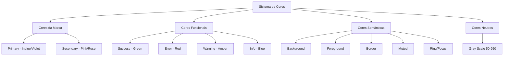

# Sistema Completo de Cores e CSS para AppBuilder

## Contexto

Precisamos criar um sistema de cores profissional e completo que:

1. Defina paleta de cores da marca (primary, secondary)
2. Crie todos os tons (50-950) para cada cor
3. Configure cores funcionais (success, error, warning, info)
4. Configure cores semânticas (background, foreground, border, etc.)
5. Integre com Tailwind CSS via variáveis CSS
6. Suporte light e dark mode
7. Integre com o design system existente
8. Resolva problemas do SideNavbar (toggle, organização, tamanhos, animações)

## Arquitetura de Cores

### Estrutura de Cores Proposta



## Paleta de Cores Profissional

### 1. Cores da Marca

#### Primary (Indigo/Violet) - Cor Principal da Marca

- **Base**: Indigo 600 (#4f46e5) - Profissional, confiável, tecnológico
- **Tons completos (50-950)**:
  - 50: #eef2ff (muito claro)
  - 100: #e0e7ff
  - 200: #c7d2fe
  - 300: #a5b4fc
  - 400: #818cf8
  - 500: #6366f1 (base)
  - 600: #4f46e5 (principal)
  - 700: #4338ca
  - 800: #3730a3
  - 900: #312e81
  - 950: #1e1b4b (muito escuro)

#### Secondary (Pink/Rose) - Cor Secundária da Marca

- **Base**: Pink 500 (#ec4899) - Moderno, energético, criativo
- **Tons completos (50-950)**:
  - 50: #fdf2f8
  - 100: #fce7f3
  - 200: #fbcfe8
  - 300: #f9a8d4
  - 400: #f472b6
  - 500: #ec4899 (base)
  - 600: #db2777
  - 700: #be185d
  - 800: #9f1239
  - 900: #831843
  - 950: #500724

### 2. Cores Funcionais

#### Success (Green) - Sucesso, Validação

- **Base**: Green 500 (#22c55e)
- **Tons completos (50-950)**: Escala completa do green

#### Error (Red) - Erro, Destrutivo

- **Base**: Red 500 (#ef4444)
- **Tons completos (50-950)**: Escala completa do red

#### Warning (Amber) - Aviso, Atenção

- **Base**: Amber 500 (#f59e0b)
- **Tons completos (50-950)**: Escala completa do amber

#### Info (Blue) - Informação

- **Base**: Blue 500 (#3b82f6)
- **Tons completos (50-950)**: Escala completa do blue

### 3. Cores Semânticas

#### Background

- **Light**: #ffffff (branco puro)
- **Dark**: #0a0a0a (quase preto)

#### Foreground (Texto)

- **Light**: #171717 (quase preto)
- **Dark**: #ededed (quase branco)

#### Muted (Backgrounds sutis)

- **Light**: #f9fafb (gray-50)
- **Dark**: #1f2937 (gray-800)

#### Border

- **Light**: #e5e7eb (gray-200)
- **Dark**: #374151 (gray-700)

#### Ring/Focus (Para focus states)

- **Light**: #6366f1 (primary-500)
- **Dark**: #818cf8 (primary-400)

### 4. Cores Neutras (Gray Scale)

Escala completa de gray (50-950) para uso geral:

- 50: #f9fafb
- 100: #f3f4f6
- 200: #e5e7eb
- 300: #d1d5db
- 400: #9ca3af
- 500: #6b7280
- 600: #4b5563
- 700: #374151
- 800: #1f2937
- 900: #111827
- 950: #030712

## Implementação

### Fase 1: Configuração de CSS e Variáveis

#### 1.1 Atualizar `globals.css`

Criar sistema completo de variáveis CSS com todas as cores:

```css
@import "tailwindcss";

:root {
  /* Cores da Marca - Primary (Indigo) */
  --color-primary-50: #eef2ff;
  --color-primary-100: #e0e7ff;
  --color-primary-200: #c7d2fe;
  --color-primary-300: #a5b4fc;
  --color-primary-400: #818cf8;
  --color-primary-500: #6366f1;
  --color-primary-600: #4f46e5;
  --color-primary-700: #4338ca;
  --color-primary-800: #3730a3;
  --color-primary-900: #312e81;
  --color-primary-950: #1e1b4b;

  /* Cores da Marca - Secondary (Pink) */
  --color-secondary-50: #fdf2f8;
  --color-secondary-100: #fce7f3;
  --color-secondary-200: #fbcfe8;
  --color-secondary-300: #f9a8d4;
  --color-secondary-400: #f472b6;
  --color-secondary-500: #ec4899;
  --color-secondary-600: #db2777;
  --color-secondary-700: #be185d;
  --color-secondary-800: #9f1239;
  --color-secondary-900: #831843;
  --color-secondary-950: #500724;

  /* Cores Funcionais - Success (Green) */
  --color-success-50: #f0fdf4;
  --color-success-100: #dcfce7;
  --color-success-200: #bbf7d0;
  --color-success-300: #86efac;
  --color-success-400: #4ade80;
  --color-success-500: #22c55e;
  --color-success-600: #16a34a;
  --color-success-700: #15803d;
  --color-success-800: #166534;
  --color-success-900: #14532d;
  --color-success-950: #052e16;

  /* Cores Funcionais - Error (Red) */
  --color-error-50: #fef2f2;
  --color-error-100: #fee2e2;
  --color-error-200: #fecaca;
  --color-error-300: #fca5a5;
  --color-error-400: #f87171;
  --color-error-500: #ef4444;
  --color-error-600: #dc2626;
  --color-error-700: #b91c1c;
  --color-error-800: #991b1b;
  --color-error-900: #7f1d1d;
  --color-error-950: #450a0a;

  /* Cores Funcionais - Warning (Amber) */
  --color-warning-50: #fffbeb;
  --color-warning-100: #fef3c7;
  --color-warning-200: #fde68a;
  --color-warning-300: #fcd34d;
  --color-warning-400: #fbbf24;
  --color-warning-500: #f59e0b;
  --color-warning-600: #d97706;
  --color-warning-700: #b45309;
  --color-warning-800: #92400e;
  --color-warning-900: #78350f;
  --color-warning-950: #451a03;

  /* Cores Funcionais - Info (Blue) */
  --color-info-50: #eff6ff;
  --color-info-100: #dbeafe;
  --color-info-200: #bfdbfe;
  --color-info-300: #93c5fd;
  --color-info-400: #60a5fa;
  --color-info-500: #3b82f6;
  --color-info-600: #2563eb;
  --color-info-700: #1d4ed8;
  --color-info-800: #1e40af;
  --color-info-900: #1e3a8a;
  --color-info-950: #172554;

  /* Cores Neutras (Gray) */
  --color-neutral-50: #f9fafb;
  --color-neutral-100: #f3f4f6;
  --color-neutral-200: #e5e7eb;
  --color-neutral-300: #d1d5db;
  --color-neutral-400: #9ca3af;
  --color-neutral-500: #6b7280;
  --color-neutral-600: #4b5563;
  --color-neutral-700: #374151;
  --color-neutral-800: #1f2937;
  --color-neutral-900: #111827;
  --color-neutral-950: #030712;

  /* Cores Semânticas - Light Mode */
  --color-background: #ffffff;
  --color-foreground: #171717;
  --color-muted: #f9fafb;
  --color-muted-foreground: #6b7280;
  --color-border: #e5e7eb;
  --color-input: #e5e7eb;
  --color-ring: #6366f1;
  --color-card: #ffffff;
  --color-card-foreground: #171717;
  --color-popover: #ffffff;
  --color-popover-foreground: #171717;
  --color-accent: #f3f4f6;
  --color-accent-foreground: #171717;
}

@media (prefers-color-scheme: dark) {
  :root {
    /* Cores Semânticas - Dark Mode */
    --color-background: #0a0a0a;
    --color-foreground: #ededed;
    --color-muted: #1f2937;
    --color-muted-foreground: #9ca3af;
    --color-border: #374151;
    --color-input: #374151;
    --color-ring: #818cf8;
    --color-card: #111827;
    --color-card-foreground: #ededed;
    --color-popover: #111827;
    --color-popover-foreground: #ededed;
    --color-accent: #1f2937;
    --color-accent-foreground: #ededed;
  }
}

@theme inline {
  /* Mapear variáveis CSS para Tailwind */
  --color-background: var(--color-background);
  --color-foreground: var(--color-foreground);
  
  /* Primary */
  --color-primary-50: var(--color-primary-50);
  --color-primary-100: var(--color-primary-100);
  /* ... todos os tons ... */
  
  /* Secondary */
  --color-secondary-50: var(--color-secondary-50);
  /* ... todos os tons ... */
  
  /* Funcionais e Neutras - similar */
}

body {
  background: var(--color-background);
  color: var(--color-foreground);
  font-family: ui-sans-serif, system-ui, -apple-system, BlinkMacSystemFont, "Segoe UI", Roboto, "Helvetica Neue", Arial, sans-serif;
}
```

#### 1.2 Criar arquivo de configuração de cores

Criar `admin/app-builder/src/shared/config/colors.ts` para gerenciar cores programaticamente:

```typescript
export const brandColors = {
  primary: {
    50: '#eef2ff',
    100: '#e0e7ff',
    // ... todos os tons
    950: '#1e1b4b',
  },
  secondary: {
    // ... similar
  },
};

export const functionalColors = {
  success: { /* ... */ },
  error: { /* ... */ },
  warning: { /* ... */ },
  info: { /* ... */ },
};

export const semanticColors = {
  background: { light: '#ffffff', dark: '#0a0a0a' },
  foreground: { light: '#171717', dark: '#ededed' },
  // ... outras cores semânticas
};
```

### Fase 2: Ajustes do SideNavbar

#### 2.1 Reorganizar estrutura da Navbar

**Arquivo**: `admin/app-builder/src/shared/components/layout/SideNavbarLayout.tsx`

- Mover ação rápida para próximo ao avatar
- Adicionar separadores adequados
- Aumentar tamanho dos ícones (w-5 h-5 → w-6 h-6)
- Aplicar cores da paleta

#### 2.2 Melhorar container main

- Adicionar padding adequado
- Aplicar cores semânticas (background, foreground)
- Melhorar espaçamento

### Fase 3: Ajustes no Design System

#### 3.1 Corrigir posicionamento do toggle

**Arquivo**: `react-design-system/src/ui/organisms/SideNavbar/components/SideNavbarToggle.tsx`

- Ajustar cálculo de posição para acompanhar transição
- Garantir que toggle se move suavemente com sidebar

#### 3.2 Remover animações indesejadas

- Remover `transition-transform` do ícone do toggle
- Verificar outras animações desnecessárias

### Fase 4: Integração com Design System

#### 4.1 Atualizar tokens de cores

Sincronizar cores do `globals.css` com o sistema de tokens do design system:

- `react-design-system/src/ui/tokens/colors.ts`
- Garantir consistência entre app-builder e design system

#### 4.2 Criar utilitários de cores

Criar helpers para usar cores de forma type-safe:

- `admin/app-builder/src/shared/utils/colors.ts`
- Funções para acessar cores da paleta
- Integração com Tailwind classes

## Estrutura de Arquivos

```
admin/app-builder/
├── app/
│   └── globals.css                    # Sistema completo de variáveis CSS
├── src/
│   └── shared/
│       ├── config/
│       │   └── colors.ts              # Configuração programática de cores
│       ├── components/
│       │   └── layout/
│       │       └── SideNavbarLayout.tsx # Ajustes com novas cores
│       └── utils/
│           └── colors.ts              # Helpers de cores
```

## Critérios de Sucesso

- Todas as cores (50-950) configuradas para primary, secondary, success, error, warning, info
- Cores semânticas funcionando em light e dark mode
- Variáveis CSS integradas com Tailwind
- SideNavbar usando cores da paleta
- Toggle button acompanhando transição corretamente
- Ícones maiores e sem animações indesejadas
- Container main com padding e cores adequadas
- Consistência entre app-builder e design system

## Próximos Passos

1. Implementar `globals.css` completo
2. Criar `colors.ts` de configuração
3. Ajustar `SideNavbarLayout.tsx`
4. Corrigir toggle no design system
5. Testar em light e dark mode
6. Validar acessibilidade de contraste